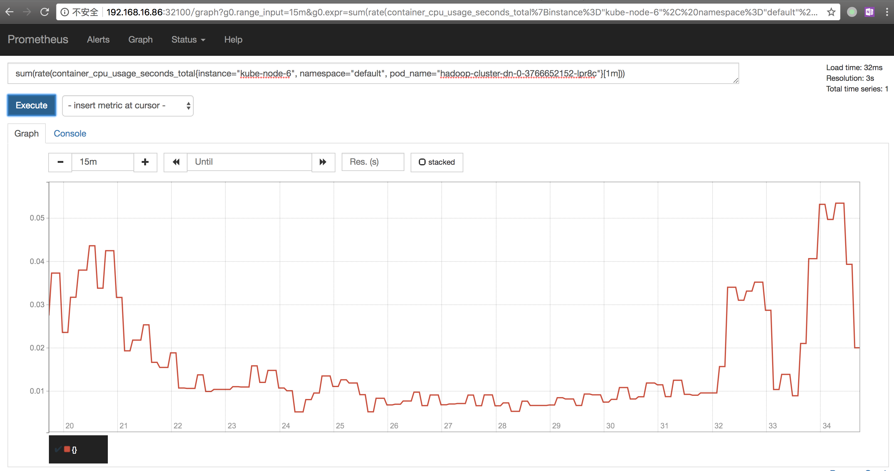
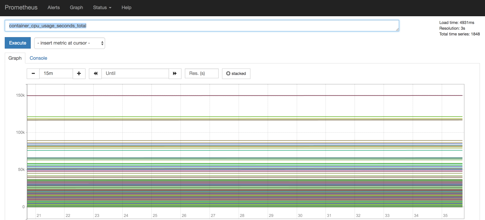
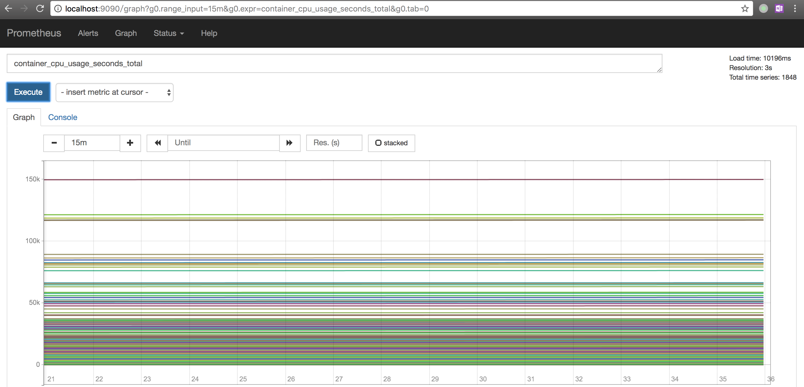

## Opentsdb Settings

### Skip Unresolved Tagvs

Set [`tsd.query.skip_unresolved_tagvs`](http://opentsdb.net/docs/build/html/user_guide/configuration.html) to `true`
to avoid 400 error when tagv not found

## Examples

### Opentsdb Query Response

Request body

```
{
    "start":1513849727,
    "end":1513850027,
    "queries":[
        {
            "metric":"container__cpu__usage__seconds__total",
            "filters":[
                {
                    "type":"literal_or",
                    "tagk":"pod_name",
                    "filter":"hadoop-cluster-dn-0-3766652152-lpr8c",
                    "groupBy":true
                },
                {
                    "type":"literal_or",
                    "tagk":"container_name",
                    "filter":"datanode",
                    "groupBy":true
                },
                {
                    "type":"literal_or",
                    "tagk":"namespace",
                    "filter":"default",
                    "groupBy":true
                },
                {
                    "type":"literal_or",
                    "tagk":"cpu",
                    "filter":"cpu00",
                    "groupBy":true
                }
            ],
            "aggregator":"none"
        }
    ]
}
```

Response body

```
[
    {
        "metric":"container__cpu__usage__seconds__total",
        "tags":{
            "image":"privatetest.com/hadoop_40sha256_.a1116c9289f278526073593e4fed28f387bc8c927634ab3f9c3f014ed1c27058",
            "instance":"kube-node-6",
            "beta_kubernetes_io_os":"linux",
            "kubernetes_io_hostname":"kube-node-6",
            "cpu":"cpu00",
            "beta_kubernetes_io_arch":"amd64",
            "hadoop_dn":"dn-0",
            "hregion":"region-0",
            "pod_name":"hadoop-cluster-dn-0-3766652152-lpr8c",
            "container_name":"datanode",
            "hadoop_jn":"jn-0",
            "name":"k8s__datanode__hadoop-cluster-dn-0-3766652152-lpr8c__default__4706fab1-e34a-11e7-ab2e-5254005aadf2__0",
            "namespace":"default",
            "id":"/kubepods/besteffort/pod4706fab1-e34a-11e7-ab2e-5254005aadf2/d95a8f76e6786e5b8f85cd25db6f565375bb48ce998aee60d258c217d83c3551",
            "job":"kubernetes-cadvisor"
        },
        "aggregateTags":[

        ],
        "dps":{
            "1513848027":1446.145751953125,
            "1513848037":1446.1646728515625,
            "1513848047":1446.1646728515625,
            "1513848057":1446.18994140625,
            "1513848067":1446.27099609375,
            "1513848077":1446.4185791015625,
            "1513848087":1446.4185791015625,
            "1513848097":1446.7950439453125,
            "1513848107":1446.7950439453125,
            "1513848117":1446.8560791015625,
            "1513848127":1446.8935546875,
            "1513848137":1446.91552734375,
            "1513848147":1446.91552734375,
            "1513848157":1446.9783935546875,
            "1513848167":1446.9783935546875,
            "1513848177":1447.0980224609375,
            "1513848187":1447.253173828125,
            "1513848197":1447.253173828125,
            "1513848207":1447.267822265625,
            "1513848217":1447.2855224609375,
            "1513848227":1447.2855224609375,
            "1513848237":1447.293212890625,
            "1513848247":1447.3148193359375,
            "1513848257":1447.3148193359375,
            "1513848267":1447.32421875,
            "1513848277":1447.33203125,
            "1513848287":1447.3377685546875,
            "1513848297":1447.3590087890625,
            "1513848307":1447.3590087890625
        }
    }
]
```

### Comparision

Prometheus local read (a few series)



Prometheus Remote read (a few series)


Prometheus local read (many series)



Prometheus Remote read (many series)

